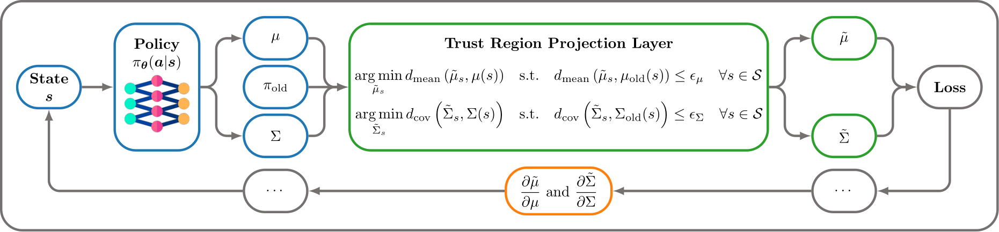

# Differentiable Trust Region Layers for Deep Reinforcement Learning

  


This is the official code for the paper "Differentiable Trust Region Layers for Deep Reinforcement Learning" by Fabian Otto et al. accepted to ICLR 2021.
The code allows the users to reproduce and extend the results reported in the study.
Please cite the above paper when reporting, reproducing or extending the results.

[[OpenReview](https://openreview.net/forum?id=qYZD-AO1Vn)][[Arxiv](https://arxiv.org/abs/2101.09207)]

## Purpose of the project

This software is a research prototype, solely developed for and published as part of the publication "Differentiable Trust Region Layers for Deep Reinforcement Learning". It will neither be maintained nor monitored in any way.

## Requirements, test, install, use, etc.

### Prerequisites
When using Mujoco environments make sure to [install](https://github.com/openai/mujoco-py) it beforehand.

### Installation 

Clone the repository and go to the project root
```bash
cd path/to/trust-region-layers
```

Create and activate a virtualenv. Install the required packages with the provided `requirements.txt` 
```bash
pip install -r requirements.txt
```
**Note**: 
To use the KL projection, you also need to install the optimized C++ implementation according to [this](cpp_projection/README.md).

### Run Experiments

Hyperparameters can be found and adjusted in the corresponding [configs](configs/pg)

In order to run experiments execute e.g. 
```bash
python3 main.py configs/pg/mujoco_config.json
```
When you are interested in running multiple experiments, pass the directory containing the config files to the main
```bash
python3 main.py configs/pg/my_agent_configs/ --num-threads 10
```
where `--num-threads` can be used to change the number of parallel jobs, which process the queue of provided runs. 

## Citation
If you use this work please cite
```
@inproceedings{otto_iclr2021,
  title={Differentiable Trust Region Layers for Deep Reinforcement Learning},
  author={Otto, Fabian and Becker, Philipp and Anh Vien, Ngo and Ziesche, Hanna Carolin and Neumann, Gerhard},
  booktitle={International Conference on Learning Representations},
  year={2021}
}   
```

## License

trust_region_layers is open-sourced under the AGPL-3.0 license. See the [LICENSE](LICENSE) file for details.
For a list of other open source components included in trust_region_layer see the file [3rd-party-licenses.txt](3rd-party-licenses.txt).
